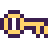
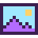
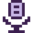
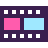

### ♡ about_me.txt

- i rice Linux until it turns into its own desktop: **[angelOS](https://github.com/MixaDoDs/AngelOS-Dotfiles)**, a whole shell on Quickshell in the spirit of *NEEDY GIRL OVERDOSE*
- daily driver: **CachyOS + niri**, fish, kitty, Neovim
- when Linux annoys me, i write a small tool for it
- じ is just a japanese symbol i like. i'm a silly cat

### ♡ my_programs/

<table>
<tr>
<td width="33%" valign="top" align="center">
 
<a href="https://github.com/MixaDoDs/AngelOS-Dotfiles"><b>angelOS</b></a> 
 
CachyOS + niri rice with its own desktop shell. Pixel and macOS looks, a game, plugins
</td>
<td width="33%" valign="top" align="center">
 
<a href="https://github.com/MixaDoDs/hidpass"><b>hidpass</b></a> 
 
Gives USB HID devices access for WebHID, VIA and keyboard configurators. Go
</td>
<td width="33%" valign="top" align="center">
 
<a href="https://github.com/MixaDoDs/BongaDeck"><b>BongaDeck</b></a> 
 
Bongo cat on top of every window on KDE/Wayland. C++/Qt
</td>
</tr>
<tr>
<td width="33%" valign="top" align="center">
 
<a href="https://github.com/MixaDoDs/PixelStreetArt_Wallpapers"><b>PixelStreetArt Wallpapers</b></a> 
 
Wallpaper packs for angelOS: Lain, pixel, green pixel art
</td>
<td width="33%" valign="top" align="center">
 
<a href="https://github.com/MixaDoDs/rodecaster-duo-channels"><b>rodecaster-duo-channels</b></a> 
 
RØDECaster Duo on Linux: separate channels and mix-minus for Discord
</td>
<td width="33%" valign="top" align="center">
 
<a href="https://github.com/MixaDoDs/mediafix"><b>mediafix</b></a> 
 
Gets video and audio ready for DaVinci Resolve in one command
</td>
</tr>
</table>

### ♡ tools.exe

~ thanks for visiting, come back soon ♡ ~

